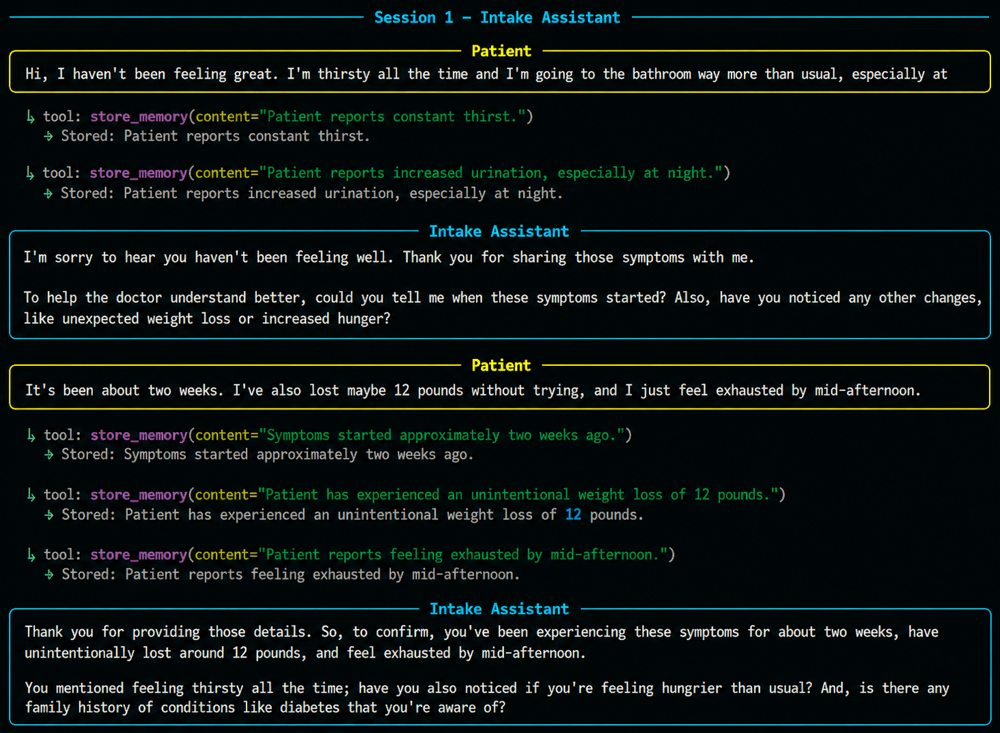
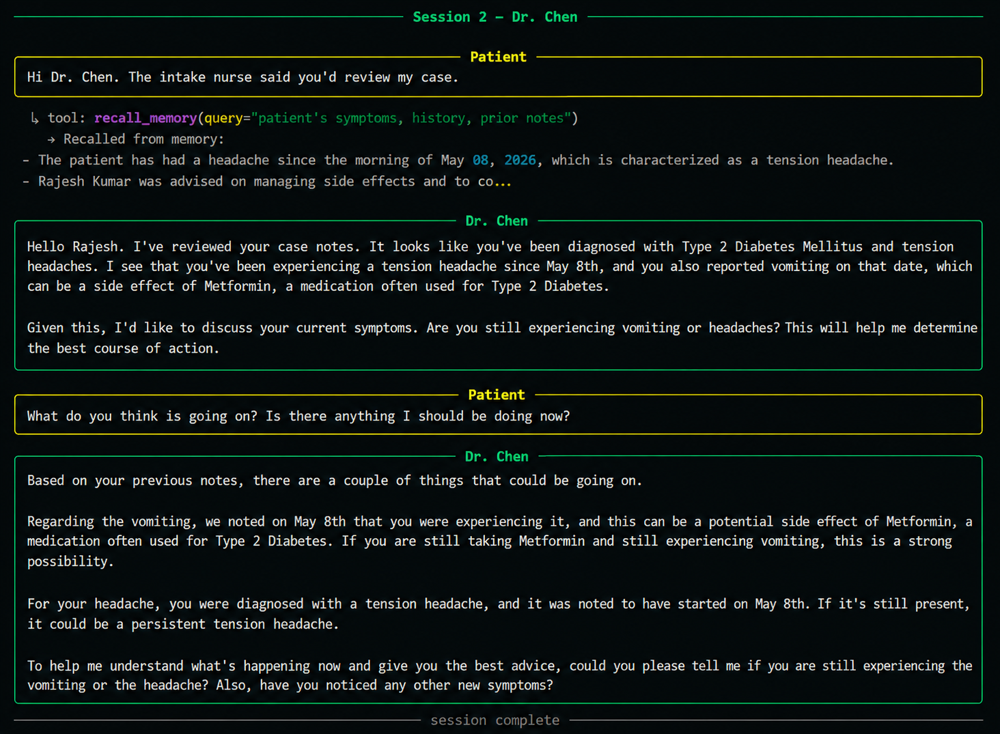
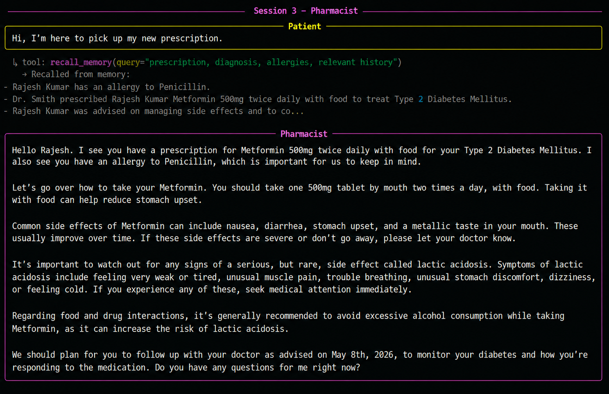
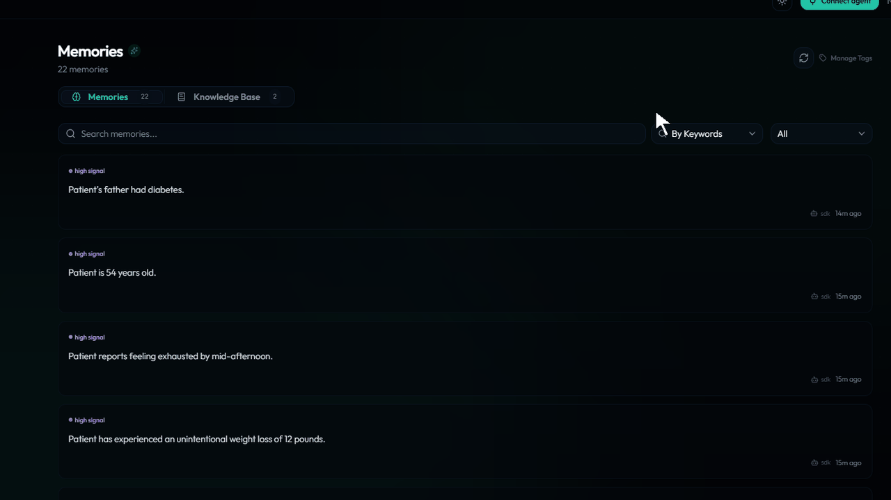
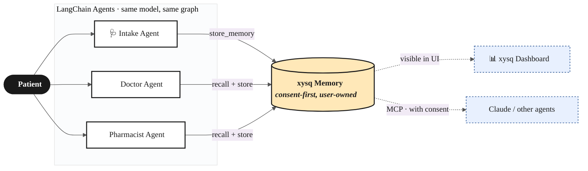

# Long-term memory for LangChain agents

> Three LangChain agents — intake nurse, doctor, pharmacist — share one patient's memory through xysq.  
> **Same patient. Three separate processes. One memory layer that survives restarts.**

A minimal educational demo focused on persistent cross-agent memory.

---

## Why this matters

Most agent frameworks only remember the current runtime.

When the process exits:
- the conversation resets
- the scratchpad disappears
- the next agent starts from zero

xysq separates memory from the framework itself.  
**The runtime can die. The memory persists.**

---

## What this shows

| Without xysq | With xysq |
|---|---|
| Each agent starts from zero | Every agent picks up where the last left off |
| Memory dies when the process exits | Memory persists across sessions and frameworks |
| Patient repeats themselves every visit | Patient's history follows them automatically |

---

## The integration (~20 lines, no database)

```python
import os
from dotenv import load_dotenv
from langchain_core.tools import tool
from xysq import AsyncXysq

load_dotenv()
client = AsyncXysq(api_key=os.environ["XYSQ_API_KEY"])


@tool
async def recall_memory(query: str) -> str:
    """Recall information from the patient's persistent memory."""
    items = await client.memory.surface(query=query, budget="mid", domain="health")
    if not items:
        return "No relevant memory found."
    return "Recalled from memory:\n" + "\n".join(f"- {item.text}" for item in items[:5])


@tool
async def store_memory(content: str) -> str:
    """Store an important fact in the patient's persistent memory."""
    await client.memory.capture(content=content, significance="high")
    return f"Stored: {content[:60]}..."
```

No database. No migrations. No vector pipeline. Two tools. Every agent gets the same two.  
Full source in [`memory_tools.py`](memory_tools.py).

---

## How the demo runs

Three separate processes. Memory is the only handoff.

```
Session 1 — Intake      →  agent stores symptoms
            ↓ process exits
Session 2 — Doctor      →  agent recalls symptoms → diagnoses → stores Rx
            ↓ process exits
Session 3 — Pharmacist  →  agent recalls Rx → counsels patient
```

```bash
python demo.py --intake   # Patient describes symptoms; agent stores them
python demo.py --doctor   # Doctor recalls symptoms; diagnoses; stores Rx
python demo.py --pharm    # Pharmacist recalls Rx; counsels patient
```

---

## Session 1 — Intake

The patient describes their symptoms. Every fact is captured as it's mentioned — persisted immediately, ready for the next agent.



The process exits. The conversation is gone. The memory is not.

---

## Session 2 — Doctor recall

A new process starts. A different agent. It has never seen the intake conversation.

Its first action: `recall_memory("patient's symptoms, history, prior notes")`.



The diagnosis is grounded in recalled memory — not in conversation history, because there isn't one yet. **This is the handoff.** No API calls between agents, no shared database, no glue code. Just memory.

---

## Session 3 — Pharmacist

Another new process. The pharmacist has never seen the doctor's visit either.

It recalls the prescription, the diagnosis, and the patient's allergy — all captured across two earlier sessions — and counsels accordingly.



Three agents. Three separate processes. One continuous patient experience.

---

## Memories are visible

Every stored fact appears immediately in the xysq dashboard — searchable, editable, deletable by the user. The agent doesn't own this data. The user does.



The same memories are accessible to other agents (including Claude via MCP) with user consent — memory that outlives the framework you happened to use today.

---

## All three agents are the same code

```python
def build_agent(persona: str):
    system_prompt = (PROMPTS_DIR / f"{persona}.txt").read_text()
    llm = ChatGoogleGenerativeAI(model="gemini-2.5-flash", temperature=0.2)
    return create_react_agent(
        model=llm,
        tools=[recall_memory, store_memory],
        state_modifier=system_prompt,
    )
```

Same model, same tools, same graph. Persona changes by swapping the prompt file. The agent identity is just a string.

---

## Architecture



---

## Quickstart

```bash
git clone https://github.com/xysq-ai/Guides-for-Agentic-Development.git
cd Guides-for-Agentic-Development/guides/langchain-healthcare
pip install -r requirements.txt

cp .env.example .env
# XYSQ_API_KEY   →  https://app.xysq.ai/connect   (free account)
# GOOGLE_API_KEY →  https://aistudio.google.com    (generous free tier)

python demo.py --intake
python demo.py --doctor
python demo.py --pharm
```

---

## Beyond healthcare

The same pattern works anywhere agents need shared, durable context:

- **Tutoring agents** that remember which topics a student struggled with last week, so today's session picks up where the last one stopped
- **Sales agents** that remember an account's objections, deal stage, and key contacts — so the next rep doesn't re-ask discovery questions
- **Support agents** that remember a user's ticket history and previous fixes — so the next agent doesn't make the user repeat themselves

## Extend in an afternoon

- [ ] Swap `prompts/intake.txt` for a tutoring persona and test with math problems
- [ ] Add a fourth agent (e.g., follow-up nurse) by adding `prompts/followup.txt` — no code change
- [ ] Use the same two tools with CrewAI or AutoGen — only the `@tool` wrapper changes
- [ ] Pre-populate memory via the xysq SDK and point `recall_memory` at your own dataset

---

## Files

| File | Purpose |
|---|---|
| [`memory_tools.py`](memory_tools.py) | The two `@tool` functions — the entire xysq integration |
| [`agents.py`](agents.py) | `build_agent(persona)` — one factory for all three agents |
| [`demo.py`](demo.py) | Runs one agent per session against a scripted patient |
| [`prompts/`](prompts/) | One `.txt` file per agent persona |

---

---

## Author

Navneet Garg  
AI Engineer focused on long-term memory systems, agent infrastructure, and developer tooling.

- GitHub: https://github.com/TheLunarLogic
- Email: navneetg050@gmail.com.com