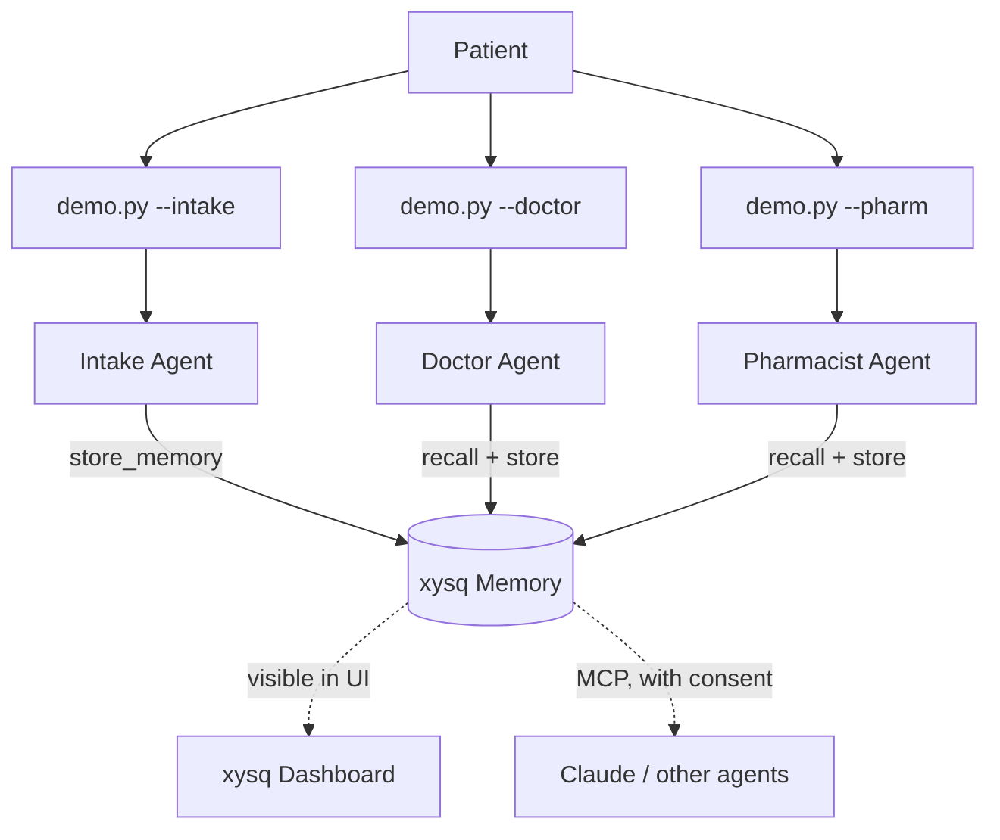

# Long-term memory for LangChain agents

> Three LangChain agents — intake, doctor, pharmacist — share one patient's memory through xysq.
> Same patient. Three personas. One memory layer that survives process restarts and travels across frameworks.

This guide shows how to give a LangChain agent **long-term memory** — facts that persist across sessions, are visible and editable in a UI, and can be shared with other agents (including a Claude agent in another framework) by user consent.

## What you'll learn

1. **Persistence** — how to capture facts in one process and recall them in another.
2. **Cross-agent sharing** — how three different agents read and write the same memory layer with no glue code between them.
3. **Semantic recall** — how the doctor agent retrieves relevant symptoms by meaning, not by keyword lookup.
4. **Visibility & portability** — every memory shows up in the xysq UI. The same memory is accessible to other agents (e.g., Claude via MCP) with user consent. Your memory is yours, not the framework's.

## The integration (≈25 lines)

The whole xysq integration is two `@tool` functions. Every agent gets the same two tools:

```python
import os
from dotenv import load_dotenv
from langchain_core.tools import tool
from xysq import AsyncXysq

load_dotenv()
client = AsyncXysq(api_key=os.environ["XYSQ_API_KEY"])


@tool
async def recall_memory(query: str) -> str:
    """Recall information from the patient's persistent memory."""
    items = await client.memory.surface(query=query, budget="mid", domain="health")
    if not items:
        return "No relevant memory found."
    lines = [f"- {item.text}" for item in items[:5]]
    return "Recalled from memory:\n" + "\n".join(lines)


@tool
async def store_memory(content: str, tags: list[str] | None = None) -> str:
    """Store an important fact in the patient's persistent memory."""
    result = await client.memory.capture(
        content=content,
        tags=tags or ["healthcare"],
        significance="high",
    )
    await client.memory.wait(result.memory_id, timeout=10, interval=0.5)
    return f"Stored: {content[:60]}..."
```

That's the integration. `surface` is semantic recall (ranked by meaning); `capture` writes a fact; `wait` blocks until the new memory is indexable so the next agent can recall it. Two tools, one client, no schema, no migrations.

> The exact code above is what's in [`memory_tools.py`](memory_tools.py). Copy it as-is.

## Memories are visible

Every fact your agent stores is visible in the xysq UI — taggable, editable, deletable by the user. The agent doesn't own the data; the user does.


*Captured memories from the intake session, visible immediately in the xysq dashboard.*

## The same memory, a different agent

The same memories are accessible to other agents through xysq's MCP server — by user consent. Here's Claude recalling this same patient's symptoms in a completely separate session:


*The patient's intake notes, recalled by Claude through the xysq MCP server. No code shared between Claude and the LangChain demo — only the memory layer.*

This is the property frameworks-as-memory don't have: **memory that outlives the framework you happened to use today.**

## All three agents are the same code

```python
# agents.py
from langchain_google_genai import ChatGoogleGenerativeAI
from langgraph.prebuilt import create_react_agent

from memory_tools import recall_memory, store_memory


def build_agent(persona: str):
    prompt_path = PROMPTS_DIR / f"{persona}.txt"
    system_prompt = prompt_path.read_text()
    llm = ChatGoogleGenerativeAI(
        model="gemini-2.5-flash",
        temperature=0.2,
        google_api_key=os.environ["GOOGLE_API_KEY"],
    )
    return create_react_agent(
        model=llm,
        tools=[recall_memory, store_memory],
        state_modifier=system_prompt,
    )
```

Same model, same tools, same graph. Persona changes by swapping the prompt file. The agent identity is just a string.

## The simulated conversation

`demo.py` runs one agent at a time against a hardcoded patient script — the run is deterministic, so you and we see the same output:

```bash
python demo.py --intake     # Session 1: patient describes symptoms
python demo.py --doctor     # Session 2: doctor recalls, diagnoses, prescribes
python demo.py --pharm      # Session 3: pharmacist recalls Rx, counsels
```

Each session is its own process. Memory is the only thing they share.

The patient is a 54-year-old presenting with classic Type 2 diabetes symptoms:

- **Intake:** "I'm thirsty all the time and going to the bathroom constantly. Lost 12 lbs in two weeks. My dad had diabetes."
- **Doctor:** "What do you think is going on?" → recalls symptoms + family history → orders A1C/FBG, prescribes Metformin if labs confirm.
- **Pharmacist:** "I'm here to pick up my prescription." → recalls Metformin → counsels on dosing, GI side effects, alcohol interactions.

The doctor never sees the intake conversation. The pharmacist never sees the doctor visit. **Memory is the only handoff.**

## Architecture



## A real run

Below is the actual captured output of `python demo.py --intake`, `--doctor`, `--pharm` run end-to-end:

> Captured run goes here once executed locally. Replace this block with the real terminal output.

## Quickstart

```bash
git clone https://github.com/xysq-ai/Guides-for-Agentic-Development.git
cd Guides-for-Agentic-Development/guides/langchain-healthcare
pip install -r requirements.txt
cp .env.example .env
# Fill in XYSQ_API_KEY (https://app.xysq.ai/connect)
# Fill in GOOGLE_API_KEY (https://aistudio.google.com - generous free tier)

python demo.py --intake
python demo.py --doctor
python demo.py --pharm
```

Run them in order — `--intake` first, then `--doctor`, then `--pharm`. Memory captured by intake takes a few seconds to index; `store_memory` waits for that automatically before returning.

## Beyond healthcare

The same pattern works anywhere agents need shared, durable context:

- **Tutoring agents** that remember which topics a student struggled with last week, so today's session can pick up where the last one stopped.
- **Sales agents** that remember an account's objections, deal stage, and key contacts — so the next rep doesn't ask the same discovery questions.
- **Support agents** that remember a user's ticket history and previous fixes — so the next agent doesn't make the user repeat themselves.

## Extend in an afternoon

- [ ] Swap `prompts/intake.txt` for a tutoring persona and test with math problems.
- [ ] Add a fourth agent (e.g., a follow-up nurse) by adding `prompts/followup.txt` — no code change.
- [ ] Use the same two tools with a different framework (CrewAI, AutoGen) — only the `@tool` wrapper changes, the xysq calls stay identical.
- [ ] Pre-populate memory via the xysq SDK and point `recall_memory` at your own dataset.

## Files

| File | Purpose |
|---|---|
| [`memory_tools.py`](memory_tools.py) | The two `@tool` functions — the entire xysq integration |
| [`agents.py`](agents.py) | `build_agent(persona)` — one factory for all three agents |
| [`demo.py`](demo.py) | Runs one agent against a hardcoded patient script |
| [`ui.py`](ui.py) | Pretty terminal output (rich-based) |
| [`prompts/`](prompts/) | One text file per persona |
